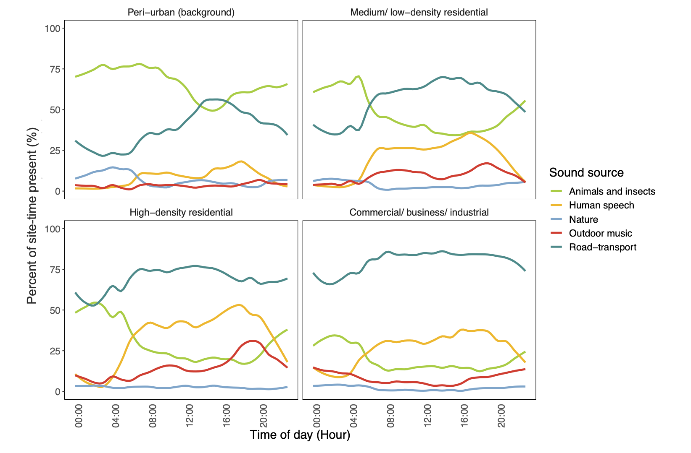

```{r setup, include=FALSE}
knitr::opts_chunk$set(echo = TRUE)
```

Sounds of engines, drilling, honking, grinding, lawn mowing, barking, music, talking, church bells and/or construction could all be subjectively perceived as noise, depending on the context. Though, sounds in the urban environment can also be calming, pleasant, and create a sense of place. Understanding trends in the total sound environment can help to priortize the sources of noise which should be mitigated, and the health promoting sounds which can be protected and enhanced. 

In Accra road-transport sounds dominated across all locations and times of the day. However, certain types of sounds were more prevalent in specific places and times. Music and human speech sounds were highest in informal high-density residential locations and animal and nature-based sounds in peri-urban outlying areas of the city. 

**24-hour trends in the prevalence (% of site-time) of different sound types across Accra**

The figure is taken from [Clark et al. Scientific Reports. 2021](https://www.nature.com/articles/s41598-021-90454-6).

