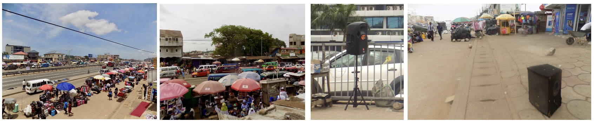
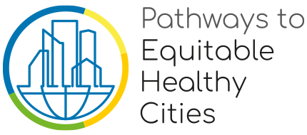

Noise is all around us in cities and affects our health and wellbeing. Health studies have shown that exposure to noise from road, rail and aircraft traffic sources can impact our health in various ways, including hearing impairment, cardiometabolic diseases, sleep disturbance, impaired cognitive function, and stress/annoyance.

Cities in sub-Saharan Africa (SSA) are undergoing significant expansion and economic transformations. Growing SSA cities are now characterized by glaring urban transport problems and traffic related noise pollution. Traffic noise also coexists with noise from human activities, such as loud, pervasive music, construction and building-works, commercial, market, and even religious activities, making noise pollution an emerging health concern. However, there are few studies and limited information on noise levels and their spatial and temporal distributions in SSA cities.  

In the west African city of Accra, Ghana, the Pathways to Equitable Healthy Cities project is measuring and characterizing noise pollution across the city. This particular work (which is showcased on this web page) stems from an ongoing PhD thesis conducted by Sierra Clark (Imperial College London (2018 - current)) in collaboration with partners at the University of Ghana, Imperial College London, University of Massachusetts Amherst, University of British Columbia (UBC), and more. 

The [Pathways to Equitable Healthy Cities](http://equitablehealthycities.org/about-us/) project is a global partnership that aims to improve population health, enhance health equity and ensure environmental sustainability in cities around the world through co-production of rigorous evidence with policy and civil society partners in cities in six countries. 

### Published open access research papers associated with this work 

[S Clark, A.S Alli, M Brauer, M Ezzati, J Baumgartner, M Toledano, A Hughes, J Nimo, J Bedford Moses, S Terkpertey, J Vallarino, S Agyei-Mensah, E Agyemang, R Nathvani, E Muller, J Bennet, J Wang, A Beddows, F Kelly, B Barratt, S Beevers, R Arku. (2020). High-resolution spatiotemporal measurement of air and envi-ronmental noise pollution in sub-Saharan African cities: Pathways to Equitable Health Cities Study pro-tocol for Accra, Ghana. BMJ Open](https://bmjopen.bmj.com/content/10/8/e035798) 

S Clark, AS Alli, R Nathvani, A Hughes, M Ezzati, M Brauer, M Toledano, J Baumgartner, J Bennett, J Nimo, J Bedford Moses, S Terkpertey, S Agyei-Mensah, G Owusu, B Croft, R Arku. (In Press). Space-time characterization of noise pollution and sound sources in Accra, Ghana. Scientific Reports.

### Web page credit

This web page was created by [Sierra Clark](https://www.imperial.ac.uk/people/sierra.clark) using R Markdown and Github. Research content created by Sierra and [Pathways project team members](http://equitablehealthycities.org). 

