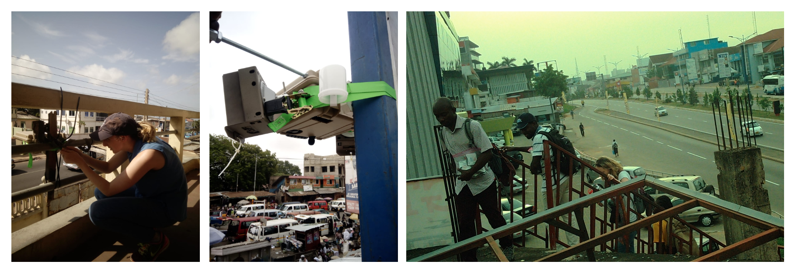

```{r setup, include=FALSE}
knitr::opts_chunk$set(echo = TRUE)
```

The Pathways project undertook an ambitious one-year measurement campaign of community noise pollution in the Greater Accra Metropolitan Area (GAMA), Ghana from 2019-2020. This campaign also included measurements of air pollution at 146 diverse locations in the city representing high-traffic locations, high-density residential, commercial, industrial, governmental, medium-density residential, low-density residential, and peri-urban areas. 

Urban sound levels were measured continuously on the decibel scale (A-weighted, dBA) with handheld sound level meters (Convergence Instruments, Canada). The sound level meters were deployed in a custom designed weather protective enclosure at ~4 meters off the ground.

More information on the measurement campaign can be found in the open access peer-reviewed protocol paper [Clark et al. BMJ Open. 2020](https://bmjopen.bmj.com/content/10/8/e035798) or from the Pathways project [blog](http://equitablehealthycities.org/blog/boosting-air-and-noise-pollution-monitoring-in-sub-saharan-african-cities/). 



Field work and data collection
